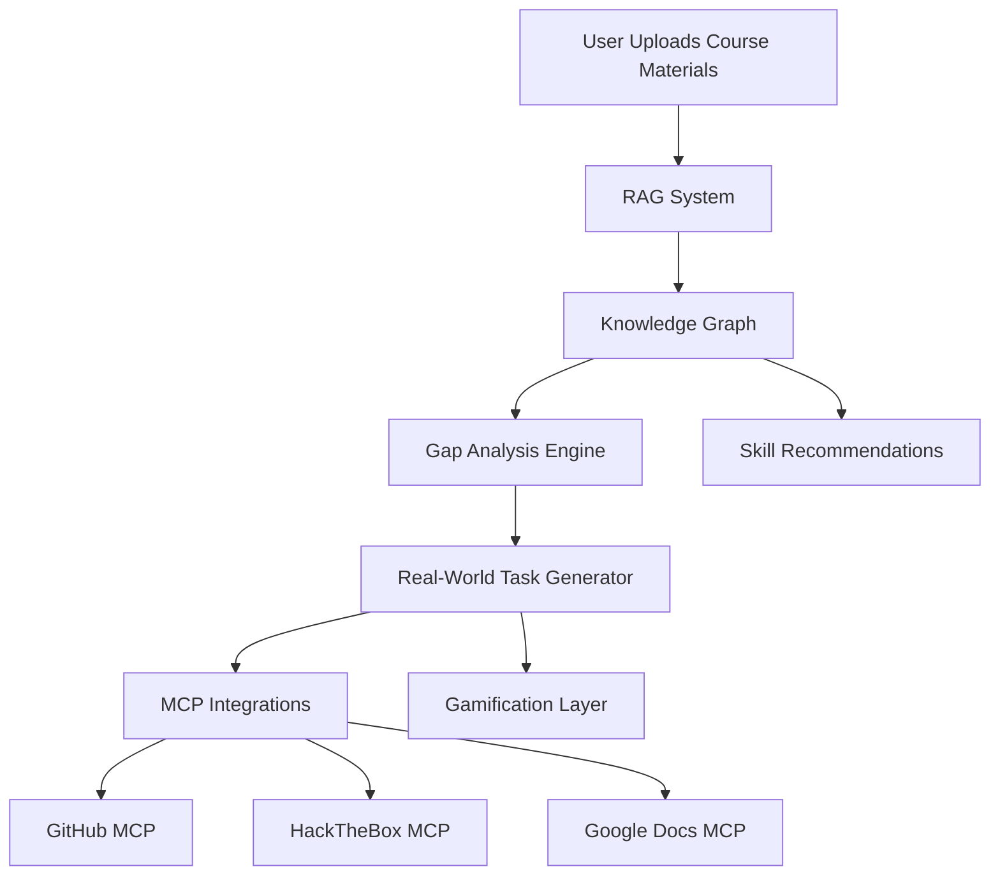

# 🌉 Gefira

> **Bridging the gap between "I have a degree" and "I have a clue."**

*An AI-powered learning platform that turns "whAt's a DoCker?" into "deployed and documented."*

[View Concept](#-the-concept) • [Technical Overview](#-technical-architecture) • [Team](#-team)

---

## 💡 The Problem

Ever felt like your university taught you everything *except* what you need for your actual job? You're not alone.

The gap between academic coursework and industry requirements has grown exponentially—especially in IT. While tech advances at breakneck speed in the AI era, traditional education struggles to keep pace. Students graduate with degrees but without the practical, market-ready skills employers demand.

**Your resume called. It's tired of lying.**

---

## 🎯 The Concept

We are proposing an **individualized learning platform** tailored for bridging the gap between higher education and market requirements with a focus on IT skills. At its core, Gefira is much more than an average GPT wrapper.

It implements **RAG on course materials** uploaded by the user, that the system indexes, for a relevant and personalized experience. The system then detects the gap between the course materials and industry standards and tasks the user with creative real-world projects. It then serves as a smart assistant with code editing capabilities (Github MCP) or task access (e.g. HackTheBox MCP for cybersec).

In the background the system maintains a **knowledge graph** of the user's skills and offers smart proposals for new, connected skills, that could be relevant in the industry. It could also maintain the CV through Google Docs MCP.

To reinforce and further motivate the user, we decided to add elements of **gamification** - a shiny badge for each new skill, a learning streak as well as luck based rewards for the extra dopamine kick. Another useful feature could be smart reminder notifications, motivating the user and reinforcing spaced repetition.

---

## 🏗️ Technical Architecture

### Core Technologies

### Key Features

#### 🔍 **RAG-Powered Personalization**
- Indexes user-uploaded course materials
- Creates context-aware learning experiences
- Adapts to individual knowledge levels

#### 🕸️ **Knowledge Graph**
- Maps user's current skill set
- Identifies skill relationships and dependencies
- Suggests relevant learning paths based on industry trends

#### 🔌 **MCP (Model Context Protocol) Integrations**
- **GitHub MCP**: Direct code editing and repository management
- **HackTheBox MCP**: Cybersecurity challenges and practical exercises
- **Google Docs MCP**: Automatic CV maintenance and portfolio building
- *Expandable architecture for future integrations*

#### 🎮 **Gamification System**
- Skill badges and achievements
- Learning streaks for consistency
- Luck-based rewards for engagement
- Smart notifications with spaced repetition

---

## 🎓 Target Audience

### Primary Users
**University students and young professionals** in technology fields:
- Computer Science
- Data Analysis
- Cybersecurity
- Software Engineering

### Secondary Users
**Educators and academic institutions** looking to:
- Modernize teaching methods
- Track student progress effectively
- Align curricula with industry standards

---

## 🚀 Transferability

While designed for IT education, Gefira's core logic is **domain-agnostic**:

| Field | Application |
|-------|-------------|
| 🏥 **Medicine** | Compare lectures with clinical guidelines; generate case-based diagnostic tasks |
| ⚙️ **Engineering** | Bridge theory with design tools; suggest real-world workflow projects |
| 📊 **Business** | Gap analysis between coursework and market practices |
| 🎨 **Design** | Industry-style projects using professional tools (Figma, AutoCAD) |

The growing ecosystem of MCP servers expands Gefira's interoperability daily, allowing seamless connection with diverse professional tools across disciplines.

---

## 📈 Impact & Vision

### Short-term
- Pilot testing with student groups
- Refine recommendation algorithms
- Partner with universities and bootcamps

### Mid-term
- Scale across multiple disciplines
- Integrate with existing educational programs
- Expand industry skill frameworks

### Long-term
- Become a lifelong learning companion
- Continuously adapt to evolving job markets
- Support professional development beyond graduation

### Social Impact
- 🌍 **Democratizes education** - Equal opportunities for students from smaller universities or rural areas
- 📚 **Promotes digital inclusion** - Aligns with SDG 4 (Quality Education)
- 🌱 **Environmental sustainability** - Reduces travel, printing, and material use through online training

---

## 🔐 Technical Challenges

- **Security**: Ensuring system integrity and user data protection
- **Accuracy**: Refining suggestions based on real-time market trends
- **Context Management**: Handling LLM context windows effectively
- **Scalability**: Managing growth as user base expands
- **Maintenance**: Adapting to rapidly evolving LLM landscape
- **Funding**: Sustaining API costs for all integrated services

---

## 👥 Team

**Team Educels** - Higher Education Students

- 🎯 **Marko Sladojević**
- 🚀 **Vukan Radojević**
- 💻 **Miloš Jovanović**
- ⚡ **Relja Brdar**

> *We're a team driven by technical expertise, curiosity, creativity, and a genuine desire to make digital learning smarter and more personal. United by our friendship and natural collaboration, we bring extensive experience in AI integration, MCPs, system design, and web technologies.*

---

## 📊 Success Metrics

The platform's effectiveness will be measured by:
- **Employment rates** of Gefira users vs. non-users
- **Time to first job** after graduation
- **Skill acquisition velocity** and retention
- **Portfolio completion rates**
- **User engagement** and learning streaks

---

## 🏆 Recognition

**DigiEduHack Srbija 2025** - Solution Canvas Submission

---

## 📄 License

This project concept is documented for DigiEduHack 2025. Implementation details and licensing to be determined.

---

**Gefira** - *Because knowing Docker shouldn't be a revolutionary concept in 2025* 🐳

Made with 💜 by Team Educels

